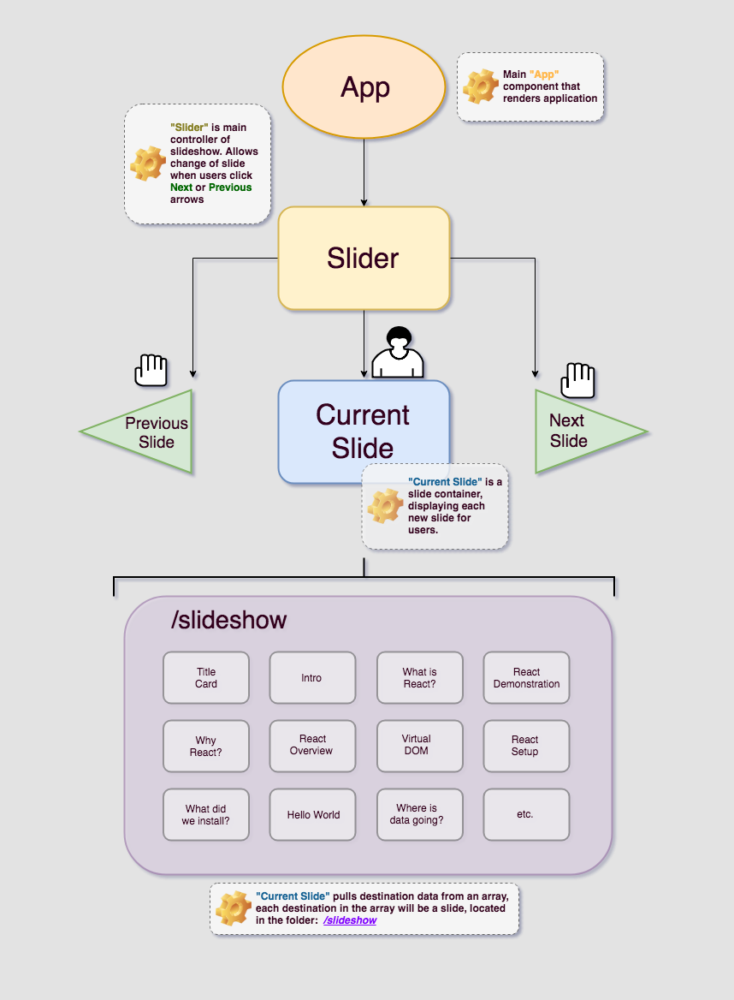

# React Interactive Lesson #

#### By _**CJ Rhone**_ 7/13/18

- - - -

### Project Description ###

_React Interactive Lesson_ will guide users through a bare-bones demonstration of how to develop an app using React; Includes an overview of app structure and visual representations of “data down, actions up” method of passing data.

### Project’s Purpose or Goal: ###
The purpose of this project is to make React easier to digest for beginners like myself. Ideally, this project will explore React for it’s strengths by allowing users to input data and learn how that data is processed.  

## Diagram ##
  

#### List the absolute minimum features the project requires to meet this purpose or goal: ####
* Slide-show style React Lesson from beginning to end
* Clickable terms and diagrams that displays more info when clicked
* Diagrams and/or visual descriptions for almost every slide

#### What tools, frameworks, libraries, APIs, modules and/or other resources (whatever is specific to your track, and your language) will you use to create this MVP? List them all here. Be specific. ####
* **React**
* **React-motion**
* **React-router**
 * with react-router-transition: `https://github.com/maisano/react-router-transition`

* **React-interactive**
 * library that provides desktop and mobile interactions with app. Website and repo here: `http://react-interactive.rafrex.com`
* **React-Image-Viewer**
 * demonstrates building a slideshow in react: `https://medium.com/@ItsMeDannyZ/build-an-image-slider-with-react-es6-264368de68e4`

* **Hot Module Reloader**
* **Redux**
* **HTML, CSS, Javascript**
* **Adobe Illustrator ( diagram design )**
* **Jest ( testing )**
* **Babel ( testing )**

#### If you finish developing the minimum viable product (MVP) with time to spare, what will you work on next? Describe these features here: Be specific. ####
* User Inputted examples
 * User inputs data and watches where it goes throughout the development process
* Design a mascot character guiding users through the tutorial
 * A purple bee named _Rea-Bee_

* Incorporate 3D assets for diagrams using three.js

#### What additional tools, frameworks, libraries, APIs, or other resources will these additional features require? ####
* Three.js
* Blender(3D)
* Adobe After Effects

#### Is there anything else you’d like to mention? ####
My big stretch goal is making this lesson more interactive with the inclusion of user-inputted data. It would allow users to input their own data and visually spot where their data is going throughout the development process. I think that is important, because knowing where and how their inputted data is processed will overall help better understand developing in react.

Beyond the MVP, I would also like to incorporate three.js to some capacity, which is a 3D creation tool using javascript. I think if implemented right, especially in creating diagrams and visual demonstrations of “data down action up” this could look really cool, and lend to a more immersive experience for visual learners.

### License

*This software is licensed under the MIT license.*

Contact: *charlesrhonejr@gmail.com*

Copyright (c) 2018 **_CJ Rhone_**
